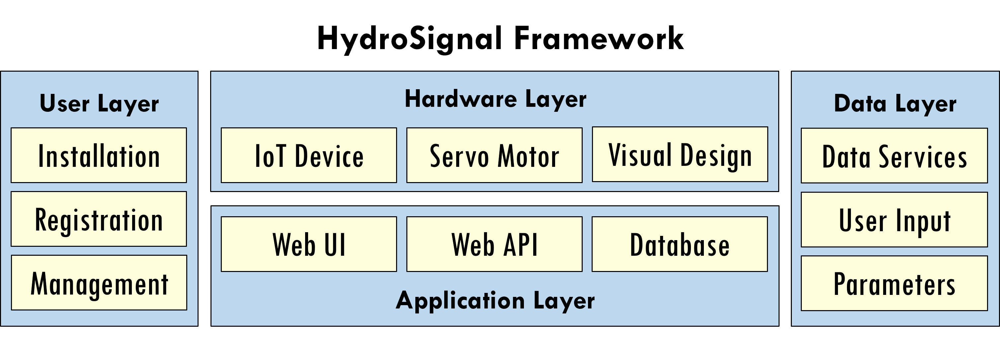
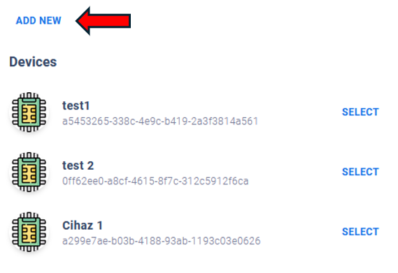
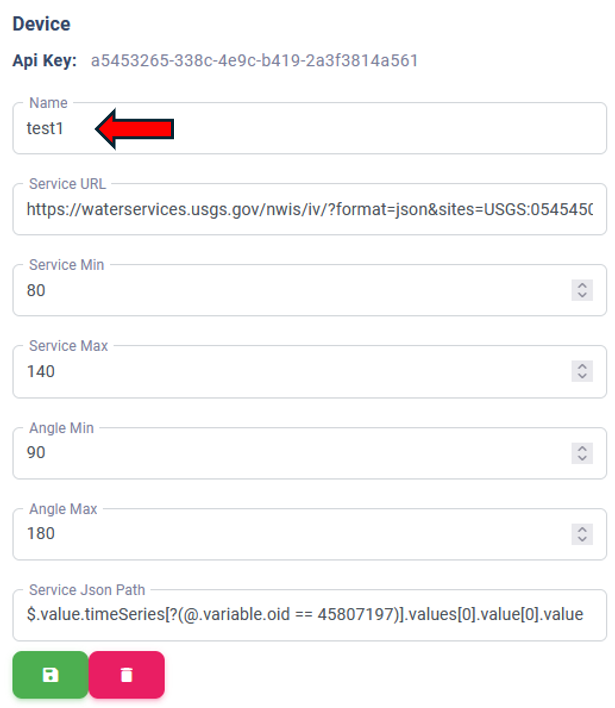
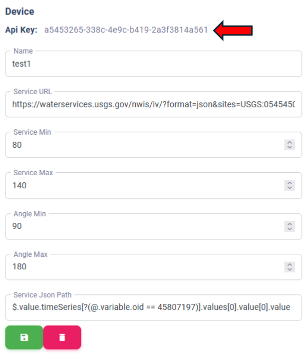

# HydroSignal
HydroSignal - IoT based Information Communication Framework for Hydrological Education and Outreach
## Introduction
HydroSignal is an open-source Internet of Things (IoT) information communication platform designed for hydrological education and outreach. It leverages IoT technology to provide real-time monitoring and visualization of various hydrological parameters, making vital environmental data accessible to professionals, educators, and students.

## Description of HydroSignal
HydroSignal aims to democratize hydrological monitoring by offering a low-cost, user-friendly platform. The platform integrates IoT devices with a web-based interface to facilitate real-time acquisition and presentation of data such as flood levels, turbidity, rainfall, and soil moisture. It supports various use cases, enhancing our understanding and management of water resources.

  

## For Educators: Quick Start Guide  
**Designed for K-12 classrooms**, HydroSignal includes step-by-step guides for teachers and students. Follow these simplified steps or access the full **Teacher’s Guide** in the web interface:  

### Hardware Setup  
**Materials**: ESP32 NodeMCU, servo motor, cables (see [Requirements](#requirements)).  

**Assembly**:  
- Connect servo to ESP32’s **GPIO Pin 12**.  
- Print and fold the [rain gauge template](./templates/pdf/box_rainfall.pdf).  

### Web Interface Setup  
- [Register your device](#device-registration) (e.g., “Classroom Rain Gauge”).  
- Configure data ranges and save your API key.  

### Classroom Implementation  
- **Lesson Plan**: Interactive sessions on rainfall data interpretation.  
- **Activities**: Real-time monitoring, needle movement analysis, and basic calculations.

**For full instructions, pre-class preparation tips, and sample lesson plans**:  
1. Log in to the [HydroSignal web interface](https://hydroinformatics.uiowa.edu/lab/hydrosignal/).  
2. Click the **“Guide”** link in the top menu.

## How to Use

### Requirements
The HydroSignal device consists of basic components such as ESP32 NodeMCU, a servo motor, and male-female patch cables.

  

- 1 ESP32 NodeMCU - [Link](https://www.adafruit.com/product/5310)
- 1 Servo Motor - [Link](https://www.adafruit.com/product/169)
- Male-female patch cables - [Link](https://www.adafruit.com/product/1953)

### Connections

The connections for the HydroSignal device are as follows:

- **ESP32 NodeMCU:**
  - Servo motor signal pin: GPIO pin 12 (PWM supported pin)
  - WiFi connection: To provide internet access
- **Servo motor:**
  - Connections will be made to GPIO pin 12 of the ESP32 NodeMCU
- **Male-female patch cables:**
  - Used to ensure secure and stable connections

### Device Registration

Web application can be accessed on [https://hydroinformatics.uiowa.edu/lab/hydrosignal/](https://hydroinformatics.uiowa.edu/lab/hydrosignal/)

1. Access the HydroSignal web interface. [Link](https://hydroinformatics.uiowa.edu/lab/hydrosignal/)
2. Create a [new account](https://hydroinformatics.uiowa.edu/lab/hydrosignal/authentication/sign-up) or [log in](https://hydroinformatics.uiowa.edu/lab/hydrosignal/authentication/sign-in).
3. Navigate to the "Devices" section and create a new device registration with "Add New" link.

  

4. Configure IoT device

- Name: Define the name of device.
- Service URL: The URL of JSON supported data service.
- Service value range: Minimum and maximum values of data from service.
- Servo motor value range: Minimum and maximum angle values which user wants to set between.
- JSON Path: The path of the value to extract only specified data from JSON document.

  

5. Obtain the generated API key.

     
  

### Firmware Upload

1. Download the provided code from this repository.
2. Replace the API key with the generated value from the previous step.
3. Open Arduino IDE and upload the code to the ESP32 NodeMCU.

### WiFi Settings

1. Power up the device.
2. Connect to the device's own AP to configure WiFi settings.
3. Open a web browser and navigate to the device's IP address.
4. Enter the desired WiFi network and password.
5. Wait for the device to restart.

### Paper Templates

1. Select a template based on the data type you want to monitor.
 - Flood - [svg](./templates/box_flood_level.svg), [pdf](./templates/pdf/box_flood.pdf)
 - Rainfall - [svg](./templates/box_rainfall.svg), [pdf](./templates/pdf/box_rainfall.pdf)
 - Template Moisture & Temprature - [svg](./templates/box_moisture_temp.svg), [pdf](./templates/pdf/box_moist_temp.pdf)
 - Turbidity - [svg](./templates/box_turbidity.svg), [pdf](./templates/pdf/box_turbidity.pdf)
 - Blank - [svg](./templates/box_blank.svg), [pdf](./templates/pdf/box_blank.pdf)
2. Print the template onto paper.
3. Use the paper template to create a 3D model.

By following these steps, you can successfully create the HydroSignal IoT device. If you have any questions, please feel free to reach out to us.

## Feedback
Please feel free to send feedback to us on any issues found by filing an [issue](https://github.com/uihilab/HydroSignal/blob/master/.github/ISSUE_TEMPLATE/feature_request.md).

## License
This project is licensed under the MIT License - see the [LICENSE](https://github.com/uihilab/HydroLang/blob/master/LICENSE) file for details.

## Acknowledgements
This project is developed by the University of Iowa Hydroinformatics Lab (UIHI Lab):

https://hydroinformatics.uiowa.edu/.

## References

* Kaynak, B., Mermer, O., Sermet, Y., Demir, I. (2025). HydroSignal: Open-Source Internet of Things Information Communication 
Platform for Hydrological Education and Outreach. EartharXiv preprint. https://doi.org/10.31223/X5R98C
 
